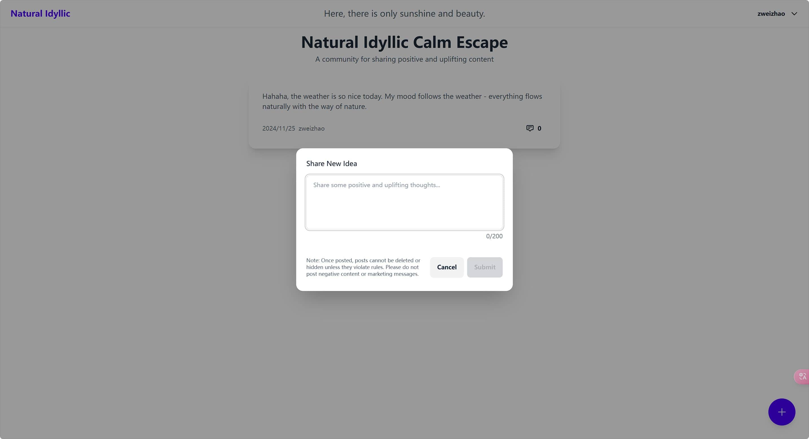

[中文文档](./README-cn.md)

# Nice Community

[Live Demo on Vercel](https://nice-community.vercel.app/)

A social platform focused on sharing positive and uplifting content.

Perfect for frontend developers transitioning to full-stack development and getting started with AIGC learning.

## Key Features

- Mobile-first design
- 200-character limit for content sharing
- AI-powered content moderation for positive content
- Friendly comment interaction system

## Tech Stack

- Express + TypeScript (Backend Framework)
- EJS (Server-side Rendering)
- Alpine.js (Frontend Interactions)
- Tailwind CSS (Styling Framework)
- LLM Service (Content Moderation)
- LeanCloud (Backend Cloud Service, ServerLess)

## Project Structure

- locals: Internationalization, currently supports Chinese and English (only English in use)
- public: Static assets
- routes: Route handlers
- services: Service layer
- utils: Utility functions (currently for i18n)
- views: View templates
- app.js: Entry point
- .env: Environment variables (required fields: OPENAI_API_KEY, LEANCLOUD_APP_ID, LEANCLOUD_APP_KEY, LEANCLOUD_SERVER_URL (required for China service), LEANCLOUD_APP_MASTER_KEY)

**Note: Since only English is used for internationalization, you can ignore the Chinese text you might see.**

## LeanCloud Setup

You can sign up for a free LeanCloud account. Their ServerLess service is available in the free tier.

Follow the official documentation to fill in the relevant parameters, then create two Classes: `Post` and `Comment`, and you're good to go.

## Deployment Instructions

Local development: `npm run dev`

For self-hosted servers: `node app.js`

For Vercel deployment: Use `vercel` for testing or `vercel --prod` for production. Remember to add your .env variables to Vercel's environment variables.
